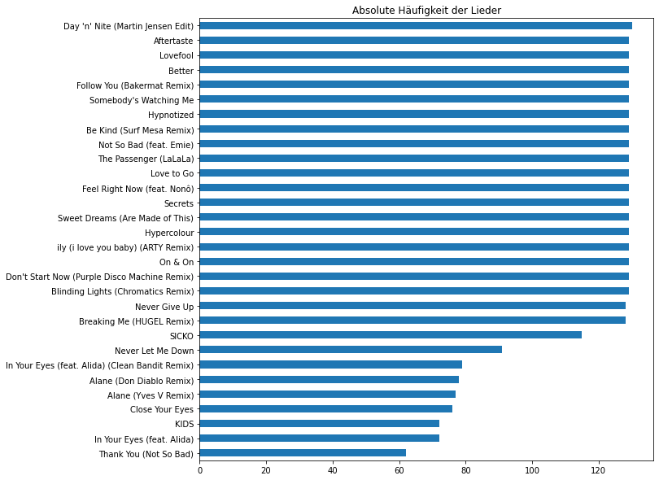
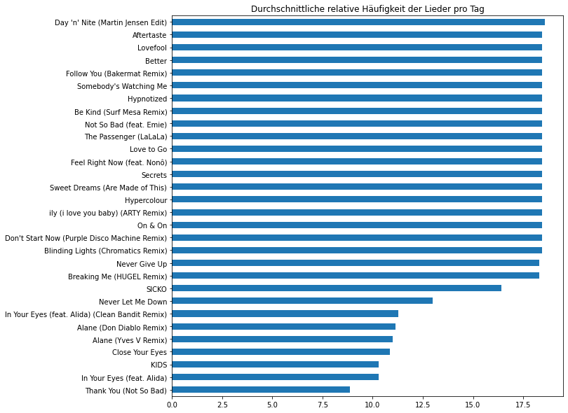
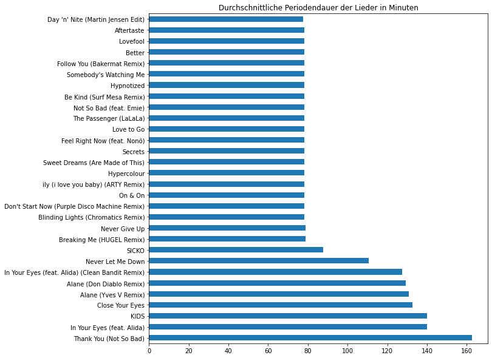
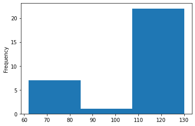
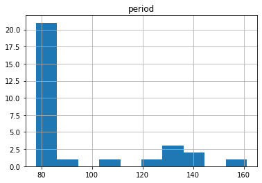
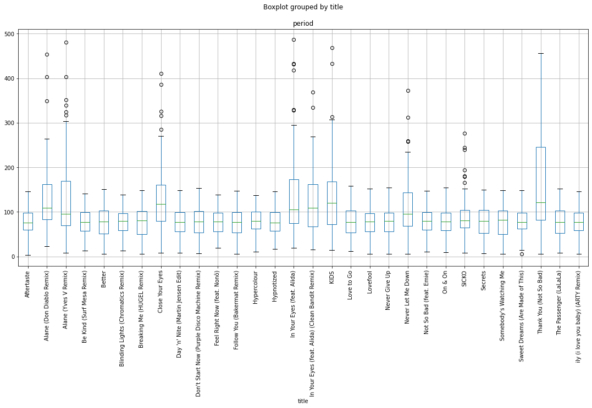

Aus gegebenem Anlass stellt sich die Frage: Wie arg wiederholt sich die Playlist von Sunshine Live Charts Stream eigentlich wirklich?
Ein idealer Anlass um sich an einem freien Sonntag mal mit JupyterLab vertraut zu machen.

<!--more-->

## Rohdaten

Die Playlist kann von der Sunshine Live Webseite per API abgefragt werden.


```python
endpoint = "https://iris-sunshinelive.loverad.io/search.json"
delta_t = pd.Timedelta(1, 'W')
params = {
    'station': 24,
    'start': pd.Timestamp('2021-09-20T00:00:00+0200'),
    'end': pd.Timestamp('2021-09-20T00:00:00+0200') + delta_t
}
res = requests.get(endpoint, params=params)
```

Die Rohdaten können jetzt mit Pandas eingelesen und aufbereitet werden.


```python
df = pd.json_normalize(res.json()['result']['entry'], 
                       record_path=['song', 'entry'], 
                       meta=[ 'airtime' ])
df = df[['title', 'airtime']]
df['airtime'] = pd.to_datetime(df['airtime'])
```

Und so sehen unsere Daten dann aus:


```python
df.head()
```

| title                              | airtime                            |
| ---------------------------------- | ---------------------------------- |
| Day 'n' Nite (Martin Jensen Edit)  | 2021-09-26 23:58:42+02:00          |
| Never Let Me Down                  | 2021-09-26 23:56:10+02:00          |
| Sweet Dreams (Are Made of This)    | 2021-09-26 23:53:45+02:00          |
| Hypercolour                        | 2021-09-26 23:50:23+02:00          |
| ily (i love you baby) (ARTY Remix) | 2021-09-26 23:47:21+02:00          |


### Eckdaten

Der Datensatz besteht aus 3430 Beobachtungen und umfasst einen Zeitraum von 7 days 00:00:00.
In diesem Zeitraum wurden **30 verschiedene** Lieder gespielt.


## Häufigkeitsanalyse

Wie oft wurde welches Lied im Auswertungszeitraum gespielt?


```python
freq = df['title'].value_counts()
freq.plot(kind='barh', title="Absolute Häufigkeit der Lieder", figsize=(10,10)).invert_yaxis()
```


    

    


Daraus ergibt sich eine relative Häufigkeit jedes Liedes pro Tag:


```python
freq_per_day = freq / (delta_t.total_seconds() / (3600 * 24))
freq_per_day.plot(kind='barh', title="Durchschnittliche relative Häufigkeit der Lieder pro Tag", figsize=(10,10)).invert_yaxis()
```


    

    


Im Umkehrschluss lässt sich die durchschnittliche Periodendauer jedes Liedes abschätzen, also die Zeitdauer nach der ein bestimmtes Lied erneut gespielt wird.


```python
freq_per_minute = freq / (delta_t.total_seconds() / 60)
period_in_m = 1 / freq_per_minute
period_in_m.plot(kind='barh', title="Durchschnittliche Periodendauer der Lieder in Minuten", figsize=(10,10)).invert_yaxis()
```


    

    


## Zwischenfazit


Das Programm von SSL Charts besteht aus 30 Liedern und wiederholt sich durchschnittlich alle **93** Minuten!


(Durchschnittswerte basierend auf der Gesamtmenge. Detailbetrachtung je Lied folgt.)

### Rotation


```python
freq.plot(kind='hist',bins=3);
```


    

    


Klar zu erkennen ist die *Hot Rotation*, bestehend aus 21 Songs, eine kleine *Medium Rotation* von zwei Liedern und sieben Lieder in der *Low Rotation*.

## Detailbetrachtung

Machen wir es genauer und ermitteln die Differenz zwischen den Spielzeiten je Lied.


```python
df.sort_values(['title', 'airtime'], inplace=True)
df['period'] = df['airtime'].diff()

df['period'].mean()
```


    87.95305392156843


Die mittlere Periodendauer über alle Lieder liegt etwas niedriger als die erste Abschätzung.

Heruntergebrochen auf die einzelnen Lieder zeigt sich wieder die Verteilung auf die Hot-/Medium-/Low-Rotation:


```python
df.groupby('title').mean()
```

| title                                           | period     |
| ----------------------------------------------- | ---------- |
| Aftertaste                                      | 78.285286  |
| Alane (Don Diablo Remix)                        | 128.295022 |
| Alane (Yves V Remix)                            | 132.007018 |
| Be Kind (Surf Mesa Remix)                       | 78.224740  |
| Better                                          | 78.135026  |
| Blinding Lights (Chromatics Remix)              | 78.222005  |
| Breaking Me (HUGEL Remix)                       | 78.308924  |
| Close Your Eyes                                 | 131.925333 |
| Day 'n' Nite (Martin Jensen Edit)               | 78.088630  |
| Don't Start Now (Purple Disco Machine Remix)    | 78.074609  |
| Feel Right Now (feat. Nonô)                     | 78.433333  |
| Follow You (Bakermat Remix)                     | 77.767578  |
| Hypercolour                                     | 78.373437  |
| Hypnotized                                      | 78.155859  |
| In Your Eyes (feat. Alida)                      | 140.286620 |
| In Your Eyes (feat. Alida) (Clean Bandit Remix) | 123.229487 |
| KIDS                                            | 137.674883 |
| Love to Go                                      | 78.067708  |
| Lovefool                                        | 78.036458  |
| Never Give Up                                   | 78.326115  |
| Never Let Me Down                               | 110.961296 |
| Not So Bad (feat. Emie)                         | 77.943490  |
| On & On                                         | 78.268229  |
| SICKO                                           | 87.441228  |
| Secrets                                         | 78.352995  |
| Somebody's Watching Me                          | 77.852995  |
| Sweet Dreams (Are Made of This)                 | 78.438411  |
| Thank You (Not So Bad)                          | 161.241530 |
| The Passenger (LaLaLa)                          | 78.007422  |
| ily (i love you baby) (ARTY Remix)              | 78.633333  |

Mehr als 20 der 30 Lieder wiederholen sich nach durchschnittlich 83 Minuten.

```python
df.groupby('title').mean().hist();
```
    



Schauen wir uns die Verteilung der Zeitabstände im Detail an:


```python
df.boxplot(column='period', by='title', figsize=(18,8), rot=90.0);
```


    

    


Bei den meisten Liedern liegt das Minimum alarmierend nahe an der Null, was bedeutet, dass diese Lieder in Einzelfällen fast direkt hintereinander erneut gespielt wurden!
Der Mittelwert liegt dabei in etwa auf dem Niveau von 85 Minuten mit geringer Streubreite.

## Fazit

Mit 30 Liedern nicht gerade abwechslungsreiches Programm, aber das merkt man auch schon, wenn man den Sender einfach mal für einen Tag hört :joy:.

Das Jupyter Notebook gibt's [hier](ssl-charts-analyse.ipynb) zum Download.
